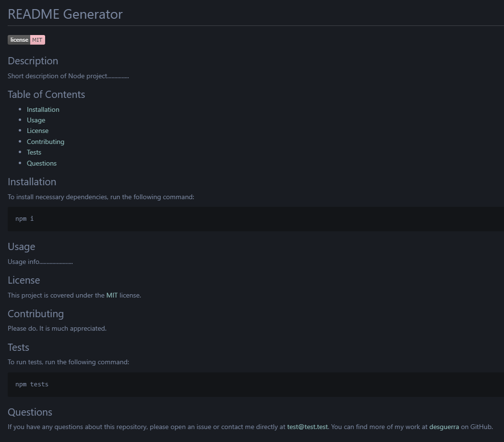

# Module #6 Challenge: Professional README Generator

## Description

This project is a **professional README generator** that uses **NodeJS** and **npm Inquirer**. After the user answers the series of prompts, a professional README.md file will we written to `dist > README.md`.

## Table of Contents

* [Installation](#installation)
* [Usage](#usage)
* [Contributing](#contributing)
* [Tests](#tests)
* [Questions](#questions)


## Installation

To install necessary dependencies, run the following command:
```
npm i
```

## Usage

In the root directory of the project, run the following command to start a series of prompts:
```
node index
```

Example of a generated README file:



## Contributing

Please do. It is much appreciated.

## Tests

To run tests, run the following command:
```
npm tests
```

## Questions

If you have any questions about this repository, please open an issue. You can also find more of my work at [desguerra](https://github.com/desguerra) on GitHub.